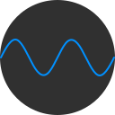
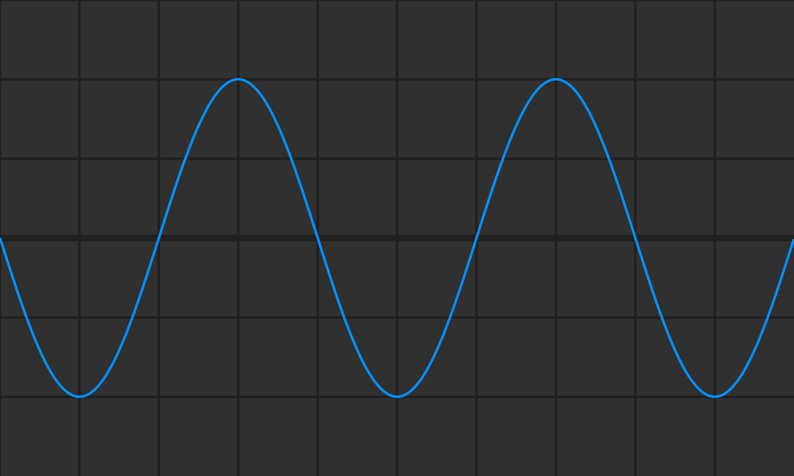

# Wave Generator

As the name suggests, this is simple wave generator that generates a sine wave based on the given wavelength, amplitude and color.

You can also download the generated wave as a PNG file.

**Example Wave:**

